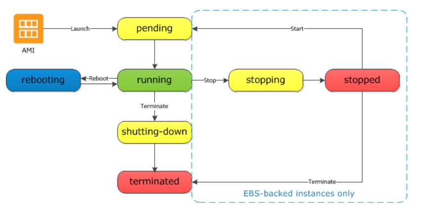
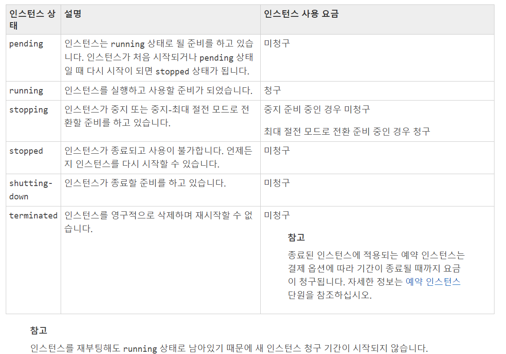

# Elastic Compute Cloud (EC2)
* Amazon Web Services (AWS) 클라우드에서 제공하는 확장식 컴퓨팅 ([출처](https://docs.aws.amazon.com/ko_kr/AWSEC2/latest/UserGuide/concepts.html))

## 관련 용어 정리
* Infrastructures as a Service (IaaS)
  * 인터넷 상에서 가상화된 컴퓨팅 자원을 제공하는 클라우드 컴퓨팅의 한 형태 ([출처](https://searchcloudcomputing.techtarget.com/definition/Infrastructure-as-a-Service-IaaS))
* 클라우드 컴퓨팅
  * 인터넷을 통해 호스팅한 서비스를 제공하는 것의 총체 ([출처](https://searchcloudcomputing.techtarget.com/definition/cloud-computing))
  * 정보를 인터넷에 연결된 다른 컴퓨터로 처리 ([출처](https://ko.wikipedia.org/wiki/%ED%81%B4%EB%9D%BC%EC%9A%B0%EB%93%9C_%EC%BB%B4%ED%93%A8%ED%8C%85))
- - -
* Amazon Machine Image (AMI, [출처](https://docs.aws.amazon.com/ko_kr/AWSEC2/latest/UserGuide/ec2-instances-and-amis.html))
  * 소프트웨어 구성이 기재된 템플릿
  * 이를 통해 인스턴스 시작 가능 
* 인스턴스
  * 가상 컴퓨팅 환경
  * 유형에 따라 CPU, 메모리, 스토리지, 네트워킹 용량의 여러 가지 구성이 다름
  * 인스턴스 스토어 볼륨(임시 데이터를 저장하는 스토리지 볼륨, 인스턴스 종료 시 삭제)과 Amazon Elastic Block Store(Amazon EBS, 영구 스토리지 볼륨) 사용
    * 파일 스토리지 (EBS) vs 객체 스토리지 (S3)
      * 과금 체계가 다름
        * 전자는 처음 받은 만큼 과금, 후자는 사용한 만큼 과금
* 탄력적 IP 주소(Elastic IP, EIP)
  * 동적 클라우드 컴퓨팅을 위한 고정 IPv4 주소
  * 링크 새로 딸 필요가 없음
* 태그
  * 사용자가 생성하여 Amazon EC2 리소스에 할당할 수 있는 메타데이터

## 특징
* 보안
  * 키 페어를 사용하여 인스턴스 로그인 정보 보호(AWS - 퍼블릭 키, 사용자 개인 키)
  * 방화벽 기능
    * 보안 그룹을 사용해 인스턴스에 연결할 수 있는 프로토콜, 포트, 소스 IP 범위를 지정 
  * 루트 계정을 통해 하나의 EC2에 다른 계정이 접속할 수 있는 권한을 줄 수 있음
* 지역 (리전)
  * 내결함성 및 안정성을 위해 지역 간 격리
  * 지역 간 데이터 전송 가능하나 요금 청구
* 가용 영역 (Available Zone, AZ) ([출처](http://pyrasis.com/book/TheArtOfAmazonWebServices/Chapter02/02))
  * 데이터센터 역할
  * 한 가용 영역에서 장애 발생 시 다른 가용 영역에서 서비스 재개
* Virtual Private Clouds(VPC)를 통해 논리적으로 격리되어 있는 고객의 네트워크와 원할 때 마다 연결
  * AWS 내 서비스 간 통신을 위해서도 필요 -> 설정이 잘 되어야 지나친 과금을 막을 수 있음
  * VPN과 동일 
* Amazon CLI를 통해 자동화 가능
  * boto3를 통해 python으로 사용 가능

## 타 서비스와의 비교 ([출처](https://www.cloudberrylab.com/resources/blog/azure-vm-vs-amazon-ec2-vs-google-ce-cloud-computing-comparison/))
* Google Compute Engine (CE)
* Microsoft Azure Virtual Machines (VM)   

<table>
    <thead>
        <tr>
            <th></th>
            <th>Amazon EC2</th>
            <th>Google CE</th>
            <th>Microsoft Azure VM</th>
        </tr>
    </thead>
    <tbody>
        <tr>
            <td>GPU acceleration</td>
            <td>O</td>
            <td>O</td>
            <td>O</td>
        </tr>
        <tr>
            <td>CPU limits</td>
            <td>1 - 40</td>
            <td>1 shared - 32 dedicated</td>
            <td>1 -32</td>
        </tr>
        <tr>
            <td>Memory limits (GB)</td>
            <td>0.5 - 244</td>
            <td>0.6 - 208</td>
            <td>0.75 - 448</td>
        </tr>
        <tr>
            <td>Temporary Storage limits (TB)</td>
            <td>up to 48</td>
            <td>3</td>
            <td>4</td>
        </tr>
        <tr>
            <td>Network features supported</td>
            <td colspan="3">CDN, Direct connection, DNS, Load Balancing, Virtual private cloud network, VPN Gateway</td>
        </tr>
        <tr>
            <td>Autoscaling</td>
            <td>clone building</td>
            <td>clone building</td>
            <td>presettable group</td>
        </tr>
        <tr>
            <td>Size change</td>
            <td>O</td>
            <td>O</td>
            <td>O</td>
        </tr>
    </tbody>
</table> 

## 데이터 사이언스 관점에서의 활용 방법
* 빅데이터 분석에의 EC2 활용 ([출처](./data/Big_Data_Analytics_Options_on_AWS.pdf))
  * 빅데이터 분석 어플리케이션의 자가 관리
    * MongoDB를 포함한 NoSQL
    * dw
    * Hadoop cluster
    * Apache Storm cluster
    * Apache Kafka environment
  * 사용한만큼 지불하는 요금 체계
  * 이상적인 사용 패턴
    * 커스텀 어플리케이션을 실행해야 하는 특수한 경우
    * 컴플라이언스 때문에 직접 어플리케이션을 실행해야 하는 경우
  * 안티 패턴 
    * 매니지드 서비스
    * 전문성과 자원의 부족

## 요금 부과 체계
* 프리티어
  * 가입 후 1년 동안 750시간 EC2 t2.micro 인스턴스에 한해 제공
* 온디맨드
  * 실행하는 인스턴스에 따라 시간당 또는 초당 컴퓨팅 파워에 대한 비용 지불
  * 리전, 운영 체제, 컴퓨팅 파워에 따른 요금표는 [해당 페이지](https://aws.amazon.com/ko/ec2/pricing/on-demand/)를 참고
* 스팟 인스턴스
  * 여유 자원에 대한 경매 방식
  * 온디맨드 대비 80-90% 저렴
  * 이용 시기를 알 수 없음 
  * 더 높은 입찰 가격 제시한 사용자에게 인스턴스를 양보해야 함
    * warning 후 3분 이내 
* 예약 인스턴스
  * 1년 혹은 3년 약정
  * 온디멘드 대비 40-70% 할인
* 인스턴스의 라이프 사이클
  * 인스턴스 라이프 사이클에 따라 요금 부가 여부가 결정   
   
     
* 이외에 elastic ip, ebs에 대한 요금 관리 필요
* 출처
  * https://aws.amazon.com/ko/ec2/pricing/
  * https://tosslab.github.io/backend/2017/07/18/aws_instance_scheduler.html
  * https://www.slideshare.net/awskorea/2017-aws-startup-day-spot-deepdive-81455290